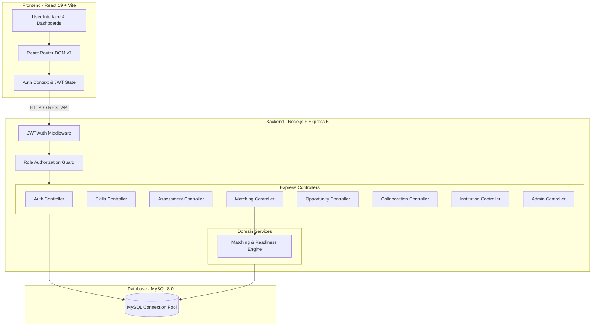

# SkillBridge

**Bridging Academia and Industry through Skills, Opportunities and Collaboration.**

> **Portal for Academia – Industry Collaboration for Skill Mapping, Internships and Placement**

[](https://sih.gov.in)
[](https://sih.gov.in)
[]()

[](https://react.dev/)
[](https://www.typescriptlang.org/)
[](https://nodejs.org/)
[](https://www.mysql.com/)
[](https://jwt.io/)

---

### Deployed Endpoints & Environments

| Environment | Service | Platform | URL |
| :--- | :--- | :--- | :--- |
| **Production** | Web Client (Frontend) | Vercel | [https://skillbridgeportal.vercel.app](https://skillbridgeportal.vercel.app) |
| **Production** | REST API (Backend) | Render | [https://skill-bridge-cxcz.onrender.com](https://skill-bridge-cxcz.onrender.com) |
| **Development** | Web Client (Frontend) | Vite Dev Server | `http://localhost:5173` |
| **Development** | REST API (Backend) | Express Server | `http://localhost:5000/api` |

---

## Table of Contents

- [1. Project Overview](#1-project-overview)
- [2. Problem Statement](#2-problem-statement)
- [3. Our Solution](#3-our-solution)
- [4. Core Features by Role](#4-core-features-by-role)
  - [Student Module](#student-module)
  - [Industry Partner Module](#industry-partner-module)
  - [Academic Institution Module](#academic-institution-module)
  - [Faculty / Academician Module](#faculty--academician-module)
  - [Admin Governance Module](#admin-governance-module)
- [5. Skill Assessment System](#5-skill-assessment-system)
- [6. Skill Gap Analysis & Target Readiness](#6-skill-gap-analysis--target-readiness)
- [7. Industry Demand Engine](#7-industry-demand-engine)
- [8. Skill-Based Opportunity Matching Engine](#8-skill-based-opportunity-matching-engine)
- [9. Internship & Placement System](#9-internship--placement-system)
- [10. Academia–Industry Collaboration Hub](#10-academiaindustry-collaboration-hub)
- [11. Verification & Trust Model](#11-verification--trust-model)
- [12. Role-Based Access Control (RBAC)](#12-role-based-access-control-rbac)
- [13. System Architecture](#13-system-architecture)
- [14. Database Schema & Data Models](#14-database-schema--data-models)
- [15. Technology Stack](#15-technology-stack)
- [16. Repository Structure](#16-repository-structure)
- [17. Installation & Local Setup Guide](#17-installation--local-setup-guide)

---

## 1. Project Overview

**SkillBridge** is an enterprise-grade, centralized **Academia–Industry Collaboration Ecosystem** designed to bridge the structural divide between higher education curricula and real-world industrial expectations. 

Unlike traditional job portals that rely solely on self-reported resume text, SkillBridge operates as a verified skill ecosystem:
1. Students prove their competency through **interactive technical skill assessments**.
2. Industry partners publish internships, placements, and collaboration initiatives with explicit **skill proficiency benchmarks**.
3. An automated **Skill Matching & Gap Analysis Engine** calculates candidate compatibility percentages, highlights missing competencies, and generates actionable career development roadmaps.
4. Educational institutions gain real-time visibility into their student body's verified skill proficiencies and industry readiness metrics.

```
+-----------------+      +-----------------------+      +-----------------------+
|     Student     | ---> | Verified Assessment   | ---> |  Skill Gap Analysis   |
| (Career Seeker) |      | (Server-Side Evaluated)|      | (Readiness Benchmark) |
+-----------------+      +-----------------------+      +-----------------------+
                                                                    |
                                                                    v
+-----------------+      +-----------------------+      +-----------------------+
|    Industry     | ---> | Opportunity & Collab  | <--- |  Skill Match Engine   |
| (Career Creator)|      | (Skill-Based Demands) |      | (Percentage Scoring)  |
+-----------------+      +-----------------------+      +-----------------------+
```

---

## 2. Problem Statement

### SIH Problem Statement ID: 26044
> **Title:** Portal for Academia – Industry Collaboration for Skill Mapping, Internships and Placement

### The Core Challenges
* **Fragmented Skill Visibility:** Academic transcripts record course grades rather than verified technical competencies (e.g. React, Docker, SQL, Machine Learning).
* **Subjective Self-Reporting:** Candidates submit generic resumes without objective proof of proficiency, increasing screening overhead for recruiters.
* **Opaque Skill Gaps:** Students lack quantitative feedback explaining why they were rejected or which specific skills they need to improve to meet target hiring criteria.
* **Isolated Institutional Monitoring:** Colleges and universities lack real-time dashboards to track overall student employability, department skill distribution, and industry alignment.
* **Siloed Academia–Industry Interaction:** Guest lectures, industrial workshops, joint research, and mentorship programs are conducted informally without centralized participant tracking or skill mapping.

---

## 3. Our Solution

SkillBridge directly addresses each challenge with verified data models and server-enforced business logic:

| Challenge | SkillBridge Solution | System Implementation |
| :--- | :--- | :--- |
| **Skill Uncertainty** | Verified Skill Assessment System | Interactive MCQ engine with server-side evaluation, dynamic scoring (0–100%), and badge issuance. |
| **Skill Mismatch** | Skill Gap & Readiness Engine | Compares student proficiency against aggregate industry demand to generate personalized improvement recommendations. |
| **Opaque Market Demand** | Real-Time Industry Demand Insights | Aggregates required skills across all active hiring postings to display top-demanded competencies and target proficiencies. |
| **Candidate Screening Overhead** | Skill-Based Matching Engine | Computes exact candidate-opportunity compatibility scores ($\%$) and skill breakdown matrices for recruiters. |
| **Application Tracking** | Application Lifecycle Management | Multi-stage pipeline (`pending` $\rightarrow$ `shortlisted` $\rightarrow$ `accepted` / `rejected`) with cover letters and verified portfolios. |
| **Siloed Industry Interactions** | Academia–Industry Collaboration Hub | Structured portal for Mentorships, Workshops, Live Projects, Guest Lectures, Hackathons, and Faculty Training. |
| **Institutional Blindspots** | Institution Analytics Roster | Departmental and degree-level filtering of student rosters with verified CGPA, skills, and readiness scores. |
| **Trust & Accountability** | Admin Verification & RBAC | Multi-tier approval workflow for industry and institution accounts before granting publishing permissions. |

---

## 4. Core Features by Role

### Student Module
* **Authentication & Profile:** JWT-based signup/login, profile management, degree, department, CGPA, bio, and location tracking.
* **Digital Skill Portfolio:** Interactive view of verified skills, proficiency levels, earning sources ("Verified Assessment" vs "Self Reported"), and skill badge indicators.
* **Interactive Skill Assessments:** Take timed technical assessments across frontend, backend, database, and programming domains.
* **Skill Gap Analysis:** View overall industry readiness score ($\%$), categorized skill status (*Strong*, *Needs Improvement*, *Critical Gap*), and personalized study advice.
* **Industry Demand Reports:** Discover top-demanded skills across active industry postings with target proficiency benchmarks.
* **Opportunity Discovery & Match Scoring:** Browse internships and jobs with real-time match breakdown (`Excellent`, `Good`, `Moderate`, `Low`) based on current assessed skills.
* **Application Management:** Submit applications with cover letters and tracking status (`pending`, `shortlisted`, `accepted`, `rejected`).
* **Projects & Certifications:** Record personal/academic projects with repository URLs and professional certifications.
* **Collaboration Participation:** Discover and register for industry-led workshops, guest lectures, hackathons, and mentorship programs.

### Industry Partner Module
* **Verification Workflow:** Immediate account access upon registration; privileged actions (posting jobs/collaborations) unlocked upon Admin verification (`verification_status = 'approved'`).
* **Company Profile Management:** Maintain company branding, logo, website, corporate bio, industry type, and headquarters location.
* **Opportunity Management:** Create, update, and manage job/internship postings with work mode (`Online`, `Offline`, `Hybrid`), stipend/salary ranges, deadlines, and required skill proficiencies.
* **Custom & Master Skill Creation:** Create and add new master skills directly to the platform database (`POST /api/skills`) and on-the-fly when configuring opportunity skill benchmarks.
* **Applicant Screening & Match Inspection:** View candidate applications sorted by match score with detailed skill breakdown matrices (matched, partial, missing skills).
* **Application Status Controls:** Promote candidates through hiring stages (`shortlisted`, `accepted`, `rejected`).
* **Initiative Creation:** Publish collaboration events (Workshops, Mentorship, Live Projects) with capacity limits, start/end dates, schedule times, and target audiences.
* **Participant Roster Management:** Review and approve student/faculty applications for published collaboration initiatives.

### Academic Institution Module
* **Institution Profile & Governance:** Manage university/college credentials, campus location, institutional code, and official website.
* **Enrolled Student Roster:** Browse all registered students associated with the institution.
* **Multi-Criteria Filtering:** Filter student rosters by Department, Degree program, Semester, and minimum CGPA.
* **Student Skill Monitoring:** Inspect aggregate skill proficiencies and verified assessment badges across departments.
* **Collaboration Visibility:** Monitor institutional participation in industry-led initiatives.

### Faculty / Academician Module
* **Academic Collaboration Access:** Shared access to institutional dashboards and student skill visibility.
* **Initiative Creation & Participation:** Host or participate in faculty development programs (FDPs), guest lectures, industrial research projects, and student mentorship.

### Admin Governance Module
* **Platform Governance Dashboard:** Centralized management console for monitoring platform health and user registrations.
* **Industry Verification Console:** Inspect pending industry registrations, verify legal credentials, and approve or reject accounts.
* **Institution Verification Console:** Approve or reject academic institution registrations to maintain ecosystem trust.

---

## 5. Skill Assessment System

The assessment system provides objective verification of technical skills via server-side evaluated multiple-choice tests.

```
+-----------------------+      +-----------------------+      +-----------------------+
|  1. Select Skill      | ---> |  2. Fetch Questions   | ---> |  3. Submit Answers    |
| (e.g. React / SQL)    |      | (Omit Correct Answers)|      | (Server-Side Eval)    |
+-----------------------+      +-----------------------+      +-----------------------+
                                                                          |
                                                                          v
+-----------------------+      +-----------------------+      +-----------------------+
|  6. Profile Updated   | <--- |  5. Badge Issued      | <--- |  4. Calculate Score   |
| (Proficiency % Saved) |      | (If Score >= 70%)     |      | (0% - 100%)           |
+-----------------------+      +-----------------------+      +-----------------------+
```

### Architecture & Security Guarantees
* **Server-Side Security:** When fetching questions (`GET /api/assessments/questions/:skillId`), the backend explicitly excludes `correct_option` and `explanation` columns from the SQL response payload to prevent client-side inspection.
* **Skill-Family Fallback Engine:** If an exact `skill_id` does not have dedicated questions loaded, the system executes a strict skill-family query fallback (e.g., mapping MySQL requests to SQL question banks or React queries to React banks) ensuring students always receive relevant technical evaluations.
* **Score & Proficiency Calculation:** Upon submission (`POST /api/assessments/submit`), responses are checked against server DB answers:
  $$\text{Score \%} = \left( \frac{\text{Correct Answers}}{\text{Total Questions}} \right) \times 100$$
* **Badge Issuance & Persistence:** If $\text{Score \%} \ge 70\%$, `is_badge_earned` is set to `true` and the score is persisted in `student_skills` with `verification_source = 'Verified Assessment'`.

---

## 6. Skill Gap Analysis & Target Readiness

SkillBridge compares a student’s current assessed proficiency against aggregated industry demand across all published opportunities.

### Mathematical Formulas

#### 1. Skill Match Percentage
For a specific demanded skill $i$:
$$\text{Match } \%_i = \min\left(100, \left\lfloor \frac{\text{Student Proficiency}_i}{\text{Required Proficiency}_i} \times 100 \right\rfloor \right)$$

#### 2. Overall Industry Readiness Index
Calculates a weighted readiness percentage across all active market demands, where the weight $W_i$ equals the total number of active job postings requiring skill $i$:
$$\text{Readiness Index} = \min\left(100, \left\lfloor \frac{\sum_{i=1}^{N} \min(\text{Student Proficiency}_i, \text{Avg Required}_i) \times W_i}{\sum_{i=1}^{N} \text{Avg Required}_i \times W_i} \times 100 \right\rfloor \right)$$

### Skill Categorization Criteria
* **Strong ($\ge \text{Avg Required}$):** Meets or exceeds industry expectations.
* **Needs Improvement ($\ge 60\%$ of $\text{Avg Required}$):** Partial competence; minor score boost recommended.
* **Critical Gap ($< 60\%$ or Unpossessed):** Urgent priority area for targeted learning and re-assessment.

---

## 7. Industry Demand Engine

The Industry Demand engine extracts real-time market signals directly from active opportunity postings (`opportunities` JOIN `opportunity_skills`).

### Aggregation Query Dynamics
The system aggregates:
1. **Demand Frequency:** Count of active hiring postings requiring the skill.
2. **Average Target Proficiency:** $\text{ROUND}(\text{AVG}(\text{required\_proficiency}))$.
3. **Peak Required Proficiency:** $\text{MAX}(\text{required\_proficiency})$.

Students use these metrics to prioritize which skill assessments to take first.

---

## 8. Skill-Based Opportunity Matching Engine

When a student views an opportunity, the `MatchingService` calculates a deterministic compatibility score.

### Match Algorithm Logic

```typescript
// Equal-weight average across all required opportunity skills
const rawAverage = totalMatchPercentageSum / requiredSkills.length;
const finalMatchScore = Math.min(100, Math.round(rawAverage));
```

### Match Category Breakdown

| Match Score Range | Category Label | Description |
| :--- | :--- | :--- |
| **80% – 100%** | `Excellent Match` | High skill alignment; prime candidate for shortlisting. |
| **60% – 79%** | `Good Match` | Solid overall fit with minor skill gaps. |
| **40% – 59%** | `Moderate Match` | Partial fit; requires supplementary training. |
| **0% – 39%** | `Low Match` | Substantial skill discrepancy. |
| *No Skills Assessed* | `Incomplete Profile` | Student has not completed relevant skill assessments. |
| *No Skills Required* | `Match Unavailable` | Opportunity has no explicit skill prerequisites. |

---

## 9. Internship & Placement System

SkillBridge provides complete application management for industry opportunities.

### Workflow Pipeline
```
[ Industry Posts Opportunity ]
             │
             ▼
[ Student Browses & Checks Match Score ]
             │
             ▼
[ Student Submits Application + Resume URL ]
             │
             ▼
[ Industry Inspects Applicants & Match Matrix ]
             │
             ├───────────────────────┬───────────────────────┐
             ▼                       ▼                       ▼
   [ Status: Shortlisted ]   [ Status: Accepted ]    [ Status: Rejected ]
```

### Supported Opportunity Types
* **Full-Time Placement**
* **Internship**
* **Apprenticeship**
* **Contract / Project-Based**

---

## 10. Academia–Industry Collaboration Hub

The Collaboration Hub fosters structured interactions between academic institutions, faculty, and industry leaders.

### Supported Collaboration Initiatives

| Collaboration Type | Description | Target Audience | Execution Mode |
| :--- | :--- | :--- | :--- |
| **Mentorship** | One-on-one or group industry guidance sessions. | Student / Both | Online / Hybrid |
| **Workshop** | Hands-on practical technical training sessions. | Student / Faculty / Both | Online / Offline / Hybrid |
| **Guest Lecture** | Expert lectures on emerging technological trends. | Student / Both | Online / Offline |
| **Innovation Challenge** | Hackathons and industrial problem-solving competitions. | Student | Online / Offline / Hybrid |
| **Live Industry Project** | Real-world industry project engagement for students. | Student | Hybrid / Offline |
| **Research Collaboration** | Joint academic-industrial research initiatives. | Faculty / Both | Hybrid / Offline |
| **Faculty Training (FDP)** | Upskilling sessions for academic faculty. | Faculty | Online / Offline |
| **Industrial Training** | On-site corporate immersion programs. | Student / Faculty | Offline |

### Initiative Controls
* **Granular Time Scheduling:** Configurable start dates, end dates, and schedule times (e.g. `10:00 AM - 04:00 PM IST`).
* **Capacity Management:** Seat capacity limits with automatic registration tracking.
* **Competency Tagging:** Association with DB master skills or dynamic custom skills.

---

## 11. Verification & Trust Model

To prevent unauthorized or fraudulent postings, SkillBridge enforces a multi-tier trust model:

```
[ User Registers as Industry / Institution ]
                    │
                    ▼
       [ Account Created in DB ]
                    │
                    ▼
     [ Status Defaults to 'pending' ]
                    │
   ┌────────────────┴────────────────┐
   │ (Can login & set up profile,    │
   │  BUT publishing is restricted)   │
   └────────────────┬────────────────┘
                    │
                    ▼
  [ Admin Reviews Credentials in Console ]
                    │
          ┌─────────┴─────────┐
          ▼                   ▼
  [ Admin Approves ]  [ Admin Rejects ]
          │                   │
          ▼                   ▼
[ Status: 'approved' ] [ Status: 'rejected' ]
(Full Publishing Access) (Access Restricted)
```

---

## 12. Role-Based Access Control (RBAC)

Authorization is strictly enforced server-side using custom Express middlewares (`authenticateToken` and `authorizeRoles`).

| Feature / Endpoint | Student | Industry Partner | Institution | Faculty | Admin |
| :--- | :---: | :---: | :---: | :---: | :---: |
| **Take Skill Assessments** | ✅ | ❌ | ❌ | ❌ | ❌ |
| **View Skill Gap Analysis** | ✅ | ❌ | ❌ | ❌ | ❌ |
| **Apply for Opportunities** | ✅ | ❌ | ❌ | ❌ | ❌ |
| **Post Opportunities** | ❌ | ✅ (Verified) | ❌ | ❌ | ❌ |
| **Screen & Shortlist Applicants** | ❌ | ✅ | ❌ | ❌ | ❌ |
| **Publish Collaboration Events** | ❌ | ✅ (Verified) | ✅ (Verified) | ✅ | ✅ |
| **View Student Roster Analytics** | ❌ | ❌ | ✅ | ✅ | ✅ |
| **Approve / Reject Verification** | ❌ | ❌ | ❌ | ❌ | ✅ |

---

## 13. System Architecture



---

## 14. Database Schema & Data Models

The MySQL database schema comprises 15 relational tables engineered with foreign key integrity.

```
                  +-------------------+
                  |       users       |
                  +-------------------+
                    /       |       \
                   /        |        \
                  v         v         v
+-------------------+ +-----------+ +----------------------+
|  student_profiles | |institutions| |  industry_profiles   |
+-------------------+ +-----------+ +----------------------+
  /        |        \                          |
 v         v         v                         v
+-------+ +--------+ +-------------+    +---------------+
|student| |student_| |student_     |    | opportunities |
|_skills| |projects| |certifications|    +---------------+
+-------+ +--------+ +-------------+      /           \
    |                                    v             v
    v                           +--------------+ +--------------+
+-------+                       | opportunity_ | | applications |
| skills|                       |    skills    | +--------------+
+-------+                       +--------------+
    |                                   
    v                                   +----------------+
+----------------------+                | collaborations |
| assessment_questions |                +----------------+
+----------------------+                   /            \
                                          v              v
                               +---------------+ +--------------+
                               | collaboration_| |collaboration_|
                               |    skills     | | participants |
                               +---------------+ +--------------+
```

### Table Definitions Summary
1. **`users`**: Core credentials (`id`, `name`, `username`, `email`, `password`, `role`, `institution_id`, `created_at`).
2. **`institutions`**: College details (`id`, `name`, `code`, `location`, `website`, `verification_status`).
3. **`student_profiles`**: Academic profile (`id`, `user_id`, `degree`, `department`, `cgpa`, `location`, `bio`).
4. **`student_skills`**: Assessed skills (`id`, `student_id`, `skill_id`, `proficiency_score`, `verification_source`, `is_badge_earned`).
5. **`student_projects`**: Portfolio projects (`id`, `student_id`, `title`, `description`, `project_url`, `repo_url`).
6. **`student_certifications`**: Certifications (`id`, `student_id`, `title`, `issuing_organization`, `issue_date`, `credential_url`).
7. **`skills`**: Master skills registry (`id`, `name`, `category`).
8. **`assessment_questions`**: MCQ bank (`id`, `skill_id`, `question`, `option_a`, `option_b`, `option_c`, `option_d`, `correct_option`, `explanation`, `difficulty`).
9. **`industry_profiles`**: Partner profiles (`id`, `user_id`, `company_name`, `industry_type`, `website`, `location`, `description`, `verification_status`, `logo`).
10. **`opportunities`**: Jobs & Internships (`id`, `industry_id`, `title`, `description`, `type`, `location`, `work_mode`, `stipend_min`, `stipend_max`, `duration`, `application_deadline`, `status`).
11. **`opportunity_skills`**: Job skill benchmarks (`id`, `opportunity_id`, `skill_id`, `required_proficiency`).
12. **`applications`**: Job applications (`id`, `student_id`, `opportunity_id`, `status`, `cover_letter`, `resume_url`, `applied_at`).
13. **`collaborations`**: Collaboration initiatives (`id`, `created_by`, `industry_id`, `institution_id`, `title`, `description`, `collaboration_type`, `target_audience`, `start_date`, `end_date`, `start_time`, `location`, `mode`, `capacity`, `status`).
14. **`collaboration_skills`**: Initiative skills (`id`, `collaboration_id`, `skill_id`).
15. **`collaboration_participants`**: Event registrations (`id`, `collaboration_id`, `user_id`, `role`, `status`, `applied_at`).

---

## 15. Technology Stack

### Frontend Architecture
* **Core Library:** React 19.2
* **Build Tool:** Vite 8.1
* **Language:** TypeScript 6.0
* **Routing:** React Router DOM 7.18
* **Styling:** Vanilla CSS3 (Custom Glassmorphism Design Token System) + TailwindCSS 4.3
* **Iconography:** Lucide React 1.34

### Backend Architecture
* **Runtime:** Node.js (ES Modules)
* **Framework:** Express 5.2
* **Language:** TypeScript 7.0
* **Database Driver:** `mysql2` 3.24 (with Promise Pool & Connection Pooling)
* **Authentication:** JSON Web Tokens (`jsonwebtoken` 9.0) + Password Hashing (`bcrypt` 6.0)
* **Validation:** Zod 4.4
* **Dev Runner:** `tsx` 4.23 + Nodemon 3.1

---

## 16. Repository Structure

```
Skill_Bridge/
├── backend/
│   ├── src/
│   │   ├── config/
│   │   │   ├── db.ts               # MySQL Connection Pool
│   │   │   └── initTables.ts       # Database Table Creation & Schema Seeding
│   │   ├── constants/
│   │   │   └── matching.constants.ts
│   │   ├── controllers/
│   │   │   ├── admin.controller.ts
│   │   │   ├── application.controller.ts
│   │   │   ├── assessment.controller.ts
│   │   │   ├── auth.controller.ts
│   │   │   ├── collaboration.controller.ts
│   │   │   ├── dashboard.controller.ts
│   │   │   ├── industry.controller.ts
│   │   │   ├── institution.controller.ts
│   │   │   ├── matching.controller.ts
│   │   │   ├── opportunity.controller.ts
│   │   │   ├── profile.controller.ts
│   │   │   └── skills.controller.ts
│   │   ├── middlewares/
│   │   │   └── auth.middleware.ts  # JWT & RBAC Guard
│   │   ├── routes/
│   │   │   ├── admin.routes.ts
│   │   │   ├── application.routes.ts
│   │   │   ├── assessment.routes.ts
│   │   │   ├── auth.routes.ts
│   │   │   ├── collaboration.routes.ts
│   │   │   ├── dashboard.routes.ts
│   │   │   ├── industry.routes.ts
│   │   │   ├── institution.routes.ts
│   │   │   ├── matching.routes.ts
│   │   │   ├── opportunity.routes.ts
│   │   │   ├── profile.routes.ts
│   │   │   └── skills.routes.ts
│   │   ├── services/
│   │   │   └── matching.service.ts # Matching & Skill Gap Calculation Engine
│   │   ├── types/
│   │   │   └── user.type.ts
│   │   └── server.ts               # Express Application Entrypoint
│   ├── package.json
│   └── tsconfig.json
│
└── frontend/
    ├── src/
    │   ├── components/             # Reusable UI Components & Layout Sidebar
    │   ├── config/
    │   │   └── api.ts              # API Base URL Config
    │   ├── context/
    │   │   ├── AuthContext.tsx     # Authentication Context & Token Storage
    │   │   └── ThemeContext.tsx    # Theme Provider Context
    │   ├── pages/
    │   │   ├── admin/
    │   │   │   └── AdminDashboard.tsx
    │   │   ├── collaborations/
    │   │   │   ├── CollaborationsPage.css
    │   │   │   └── CollaborationsPage.tsx
    │   │   ├── industry/
    │   │   │   ├── IndustryOpportunities.tsx
    │   │   │   └── IndustryProfile.tsx
    │   │   ├── institution/
    │   │   │   ├── InstitutionDashboard.tsx
    │   │   │   └── InstitutionStudents.tsx
    │   │   ├── student/
    │   │   │   ├── CompaniesPage.tsx
    │   │   │   ├── IndustryDemandReport.tsx
    │   │   │   ├── SkillGapAnalysis.tsx
    │   │   │   ├── StudentApplications.tsx
    │   │   │   ├── StudentDetails.tsx
    │   │   │   └── StudentOpportunities.tsx
    │   │   ├── Auth.tsx            # Login & Registration Page
    │   │   ├── Dashboard.tsx       # Main Student Dashboard
    │   │   └── LandingPage.tsx     # Public Hero Landing Page
    │   ├── App.tsx                 # Route Registry & Role Guards
    │   └── main.tsx
    ├── package.json
    └── vite.config.ts
```

---

## 17. Installation & Local Setup Guide

### Prerequisites
* **Node.js**: v18.0.0 or higher
* **npm**: v9.0.0 or higher
* **MySQL Server**: v8.0 or higher (Local installation or Cloud Instance e.g. Aiven / PlanetScale / Railway)

---

### Step 1: Clone Repository
```bash
git clone https://github.com/dipanjan2907/Skill_Bridge.git
cd Skill_Bridge
```

---

### Step 2: Configure & Start Backend

```bash
# Navigate to backend directory
cd backend

# Install dependencies
npm install

# Create environment configuration file
```

Create a `.env` file inside the `backend/` directory:
```env
PORT=5000
NODE_ENV=development
JWT_SECRET=your_super_secret_jwt_key_skillbridge_2026

# MySQL Database Configuration
DB_HOST=localhost
DB_PORT=3306
DB_USER=root
DB_PASSWORD=your_mysql_password
DB_NAME=defaultdb
```

```bash
# Initialize database tables and seeds automatically
npm run db:init

# Start backend server in development mode
npm run dev
```
*Backend server will start listening at `http://localhost:5000/api`.*

---

### Step 3: Configure & Start Frontend

Open a new terminal window:

```bash
# Navigate to frontend directory
cd frontend

# Install dependencies
npm install
```

Create a `.env` file inside the `frontend/` directory:
```env
VITE_API_BASE_URL=http://localhost:5000/api
```

```bash
# Start frontend development server
npm run dev
```
*Frontend application will be accessible at `http://localhost:5173`.*

---

### Default Credentials for Testing

| Role | Email | Password | Pre-set Verification Status |
| :--- | :--- | :--- | :--- |
| **Admin** | `admin@skillbridge.edu` | `admin123` | Approved |
| **Student** | `student@jisuniversity.ac.in` | `student123` | Active |
| **Industry Partner** | `hr@techcorp.com` | `industry123` | Approved |
| **Institution** | `registrar@jisuniversity.ac.in` | `institution123` | Approved |

---

<p align="center">
  <b>SkillBridge &copy; 2026</b> &bull; Smart India Hackathon (SIH) Problem Statement 26044<br/>
  <i>Bridging Academia and Industry through Skills, Opportunities and Collaboration.</i>
</p>
