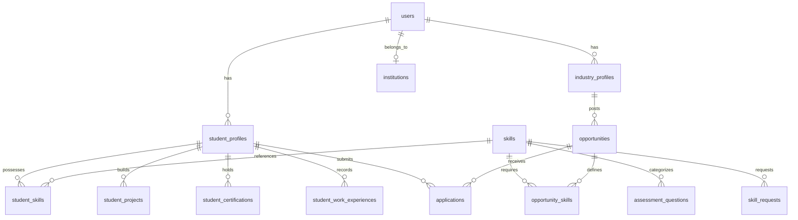

# SkillBridge

**Bridging Academia and Industry through Skills, Opportunities and Collaboration.**

> **Portal for Academia – Industry Collaboration for Skill Mapping, Internships and Placement**

[](https://sih.gov.in)
[](https://sih.gov.in)
[]()
[]()

[](https://react.dev/)
[](https://www.typescriptlang.org/)
[](https://nodejs.org/)
[](https://www.mysql.com/)
[](https://jwt.io/)

---

### Deployed Endpoints & Environments

| Environment | Service | Platform | URL |
| :--- | :--- | :--- | :--- |
| **Production** | Web Client (Frontend) | Vercel | [https://skillbridgeportal.vercel.app](https://skillbridgeportal.vercel.app) |
| **Production** | REST API (Backend) | Render | [https://skill-bridge-cxcz.onrender.com](https://skill-bridge-cxcz.onrender.com) |
| **Development** | Web Client (Frontend) | Vite Dev Server | `http://localhost:5173` |
| **Development** | REST API (Backend) | Express Server | `http://localhost:5000/api` |

---

## Table of Contents

- [1. Project Overview](#1-project-overview)
- [2. Problem Statement](#2-problem-statement)
- [3. Key Features by Role](#3-key-features-by-role)
  - [Student Module](#student-module)
  - [Industry Partner Module](#industry-partner-module)
  - [Faculty / Academician Module](#faculty--academician-module)
  - [Academic Institution Module](#academic-institution-module)
  - [Admin Governance Module](#admin-governance-module)
- [4. Skill Assessment System](#4-skill-assessment-system)
- [5. Smart Question Selection Engine](#5-smart-question-selection-engine)
- [6. Shared Question Contribution Pool](#6-shared-question-contribution-pool)
- [7. Admin Question Moderation Console](#7-admin-question-moderation-console)
- [8. Question Bank Summary & Skill Configuration](#8-question-bank-summary--skill-configuration)
- [9. Skill Management & Dynamic Requests](#9-skill-management--dynamic-requests)
- [10. Skill-Based Opportunity Matching Engine](#10-skill-based-opportunity-matching-engine)
- [11. Application Management & Recruitment Pipeline](#11-application-management--recruitment-pipeline)
- [12. Student Digital Portfolio](#12-student-digital-portfolio)
- [13. Role-Based Access Control (RBAC)](#13-role-based-access-control-rbac)
- [14. Smart Automation Architecture](#14-smart-automation-architecture)
- [15. Technology Stack](#15-technology-stack)
- [16. Database Architecture](#16-database-architecture)
- [17. API & Backend Architecture](#17-api--backend-architecture)
- [18. Project Structure](#18-project-structure)
- [19. Environment Variables](#19-environment-variables)
- [20. Installation & Local Setup Guide](#20-installation--local-setup-guide)
- [21. Deployment Architecture](#21-deployment-architecture)
- [22. Future Enhancements](#22-future-enhancements)
- [23. Hackathon / SIH Relevance](#23-hackathon--sih-relevance)

---

## 1. Project Overview

**SkillBridge** is a centralized, multi-stakeholder **Academia–Industry Collaboration Platform** built to systematically solve the skill mismatch between university graduates and real-world industrial demands. 

The platform unites five primary ecosystem stakeholders:
* **Students:** Seek objective skill evaluation, career direction, gap analysis, and skill-matched opportunities.
* **Industries:** Seek verified talent, publish skill-targeted opportunities, and contribute to shared assessment banks.
* **Faculty / Academicians:** Host collaboration initiatives (FDPs, workshops, research) and contribute technical evaluation questions.
* **Institutions:** Monitor student skill readiness, department analytics, and industry placement alignment.
* **Administrators:** Oversee verification, platform governance, skill registries, and assessment quality control.

SkillBridge powers an automated 8-stage lifecycle:
```text
Assess → Profile → Identify Skill Gaps → Recommend → Match → Apply → Track → Analyze
```

Through **intelligent rule-based matching**, **dynamic demand aggregation**, and **automated proficiency scoring**, SkillBridge replaces subjective self-reported resumes with verified competency data.

---

## 2. Problem Statement

### SIH 2026 Problem Statement ID: 26044
> **Title:** Portal for Academia – Industry Collaboration for Skill Mapping, Internships and Placement  
> **Theme:** Smart Automation

### Ecosystem Challenges Addressed

```text
┌──────────────────────────────────────────────────────────────────────────────────┐
│                                 THE SKILL GAP CRISIS                             │
├───────────────────────────────┬──────────────────────────────────────────────────┤
│ Stakeholder                   │ Core Pain Points Addressed                       │
├───────────────────────────────┼──────────────────────────────────────────────────┤
│ Students                      │ • Lack visibility into real industry skill demands│
│                               │ • Rely on unverified self-reported resumes       │
│                               │ • Do not know their exact technical skill gaps   │
│                               │ • Struggle to find relevant internships/jobs     │
├───────────────────────────────┼──────────────────────────────────────────────────┤
│ Industry Partners             │ • Manual resume screening yields poor candidate fit │
│                               │ • High applicant volume with unverified skills   │
│                               │ • Inefficient evaluation and shortlisting flow   │
├───────────────────────────────┼──────────────────────────────────────────────────┤
│ Faculty & Academicians        │ • Limited structured industry exposure            │
│                               │ • Few avenues for industry-backed training (FDP) │
│                               │ • Informal, unmonitored mentorship channels      │
├───────────────────────────────┼──────────────────────────────────────────────────┤
│ Academic Institutions         │ • No real-time analytics on student skill readiness│
│                               │ • Inability to track overall placement alignment │
│                               │ • Lack of centralized industry partner management │
└───────────────────────────────┴──────────────────────────────────────────────────┘
```

SkillBridge bridges these gaps by serving as a single source of truth for verified skills, opportunities, and academia–industry interactions.

---

## 3. Key Features by Role

### Student Module
* **Secure Auth & Profile Management:** JWT login/signup, academic profile (degree, department, semester, CGPA, graduation year).
* **Interactive Skill Assessments:** Take technical assessments linked to specific DB skills.
* **Automated Proficiency Scoring:** Server-side calculated score ($0\% - 100\%$) and automated badge issuance ($\ge 70\%$).
* **Skill Gap Analysis:** Quantitative readiness index ($\%$), skill categorization (*Strong*, *Needs Improvement*, *Critical Gap*), and actionable advice.
* **Industry Demand Insights:** Real-time demand frequency and benchmark target proficiencies across active industry postings.
* **Algorithmic Opportunity Discovery:** Browse opportunities with real-time match scoring (`Excellent`, `Good`, `Moderate`, `Low Match`).
* **Application Management:** Submit applications with uploaded resume and tracking status (`pending`, `shortlisted`, `accepted`, `rejected`).
* **Digital Portfolio:** Verified skills badges, certifications, personal/academic projects, work experience history, and social links (GitHub, LinkedIn, Portfolio).
* **Collaboration Participation:** Register for mentorships, workshops, guest lectures, hackathons, and live industry projects.

### Industry Partner Module
* **Account Verification Workflow:** Immediate registration with admin approval workflow (`pending` $\rightarrow$ `approved`).
* **Company Profile Management:** Corporate branding, sector, website, description, and contact info.
* **Multi-Type Opportunity Posting:** Post **Full-Time Jobs**, **Internships**, **Apprenticeships**, and **Live Projects** with work mode (`On-site`, `Hybrid`, `Remote`), stipend ranges, deadlines, and skill prerequisites.
* **Skill Benchmark Configuration:** Specify required proficiency levels ($1 - 100\%$) for each opportunity.
* **Candidate Match Inspection:** Screen applicants sorted by compatibility percentage with detailed skill breakdown matrices (matched, partial, missing skills).
* **Application Status Management:** Advance candidates through recruitment stages (`shortlisted`, `accepted`, `rejected`).
* **Assessment Question Contribution:** Submit custom questions to the shared question bank for review by Admin.
* **Collaboration Initiatives:** Host mentorships, workshops, hackathons, and guest lectures with seat limits and scheduling.

### Faculty / Academician Module
* **Faculty Profile & Academic Association:** Link profile to verified academic institutions.
* **Question Contribution Engine:** Submit technical questions to skill banks tagged with `source_type = 'faculty'`.
* **Collaboration Initiatives:** Host or participate in Faculty Development Programs (FDPs), guest lectures, industrial research, and mentorships.
* **Student Skill Visibility:** View student skill progress and departmental technical proficiencies.
* **Dynamic Skill Requests:** Submit formal requests for new skills to be added to the platform master database.

### Academic Institution Module
* **Institutional Dashboard:** Comprehensive overview of enrolled students, placement metrics, and active industry partners.
* **Student Roster Analytics:** Multi-criteria filtering by Department, Degree, Semester, and CGPA thresholds.
* **Skill Monitoring:** Real-time visibility into student skill proficiencies and verified badge statistics.
* **Placement & Internship Tracking:** Track student application statuses and active industrial engagements.

### Admin Governance Module
* **Verification Console:** Inspect and approve/reject pending Industry and Academic Institution registrations.
* **Assessment Question Moderation:** Moderate contributed questions across `Pending`, `Approved`, `Rejected`, and `All Questions` tabs.
* **Question Audit & Direct Editor:** View full question details, options, explanations, edit prompts directly, or reject with a mandatory feedback reason.
* **Question Bank Summary by Skill:** View total, approved, pending, and rejected question counts per skill with bank status deficit badges.
* **Skill Target Management:** Configure target question requirements per skill with inline editing.
* **Skill Request Moderation:** Review, approve, or reject skill requests submitted by industry and faculty members.

---

## 4. Skill Assessment System

SkillBridge relies on objective, server-evaluated technical assessments rather than self-reported proficiency.

```text
               Skill Assessment & Proficiency Workflow
               
Select Skill  ──►  Start Test  ──► Fetch Approved Questions (Hidden Answers)
                                                  │
                                                  ▼
Receive Badge ◄── Save Score % ◄── Evaluate Test ◄── Submit Answers
 (Score >= 70%)    to Profile       (Server DB)
```

### Key Assessment Rules
1. **Centralized Question Bank:** Questions are linked to specific skills in the `skills` table.
2. **Server-Side Evaluation:** Answers are scored exclusively on the backend (`POST /api/assessments/submit`). Correct answer options and explanations are never sent to the client during assessment delivery.
3. **Automated Proficiency Calculation:**
   $$\text{Proficiency Score \%} = \left( \frac{\text{Correct Answers}}{\text{Total Questions}} \right) \times 100$$
4. **Badge Persistence:** Scoring $\ge 70\%$ automatically grants an earned badge (`is_badge_earned = true`) and marks the skill verification source as `"Verified Assessment"`.
5. **No Manual Score Selection:** Students **cannot** manually select or alter their assessed proficiency score.

---

## 5. Smart Question Selection Engine

Instead of presenting the entire question bank, SkillBridge selects a balanced set of questions per assessment attempt based on the skill's target configuration:

* **Configurable Question Target:** Admins set a target question count per skill (default: 10–15 questions per assessment).
* **Filter by Approval:** Only questions with `status = 'approved'` are eligible for student assessments.
* **Balanced Difficulty Distribution:** Selects a mix of `Easy`, `Medium`, and `Hard` questions.
* **Contributor Diversity:** Draws questions randomly from system-generated, industry-contributed, and faculty-contributed entries.
* **Repeat Minimization:** Cross-references `assessment_attempt_questions` history to minimize question repetition across attempts.
* **Skill-Family Fallback:** If an exact skill has zero approved questions, the system fallback algorithm fetches questions from related skill families (e.g., mapping React requests to JavaScript/Frontend banks).

---

## 6. Shared Question Contribution Pool

SkillBridge uses a shared question pool per skill. Multiple verified stakeholders contribute questions to enrich the central assessment pool:

```text
                      React Question Bank
                               │
       ┌───────────────────────┼───────────────────────┐
       ▼                       ▼                       ▼
System Base Questions   Industry Questions      Faculty Questions
  (source_type: system)  (source_type: industry) (source_type: faculty)
       │                       │                       │
       └───────────────────────┼───────────────────────┘
                               ▼
                    Admin Moderation Queue
                     (status: 'pending')
                               │
                               ▼
                       Approved Pool
                (Eligible for Student Tests)
```

* Industry partners and faculty can submit questions via `POST /api/assessment/questions`.
* Contributed questions enter `status = 'pending'`.
* Once approved by an Admin, the question enters the **common shared pool** for that skill.
* Students receive a randomized blend of approved questions regardless of who contributed them.

---

## 7. Admin Question Moderation Console

The Admin Assessment Moderation dashboard (`AdminAssessmentModeration.tsx`) provides complete oversight of the question bank:

```text
┌──────────────────────────────────────────────────────────────────────────┐
│                     ADMIN QUESTION MODERATION CONSOLE                    │
├─────────────┬─────────────┬─────────────┬────────────────────────────────┤
│ Pending (3) │ Approved    │ Rejected    │ All Questions                  │
└─────────────┴─────────────┴─────────────┴────────────────────────────────┘
```

### Moderation Capabilities
* **Status Views:** Filter questions by **Pending** (default workflow), **Approved**, **Rejected**, or **All Questions**.
* **Audit Details Modal:** Inspect full question text, options A–D, correct answer, explanation, difficulty, contributor source, and rejection reason.
* **Approve Action:** Single-click approval (`PUT /api/admin/assessment/questions/:id/approve`) moves pending questions into active student assessment pools.
* **Reject Action:** Rejection modal requires a mandatory rejection reason (`PUT /api/admin/assessment/questions/:id/reject`), notifying contributors.
* **Inline Direct Editor:** Admins can edit question text, options, difficulty, or correct answer key (`PUT /api/admin/assessment/questions/:id`).
* **Multi-Param Filtering:** Filter questions by Skill, Difficulty (`Easy`, `Medium`, `Hard`), and Contributor Source (`system`, `industry`, `faculty`).
* **Server-Side Pagination:** Efficient page navigation across large question repositories.

---

## 8. Question Bank Summary & Skill Configuration

Located under the **Question Bank & Skill Config** tab, this view provides dynamic question statistics for every skill in the database:

| Skill | Category | Target Questions | Total | Approved | Pending | Rejected | Bank Status | Actions |
| :--- | :--- | :---: | :---: | :---: | :---: | :---: | :---: | :---: |
| **JavaScript** | Programming | **15** | 32 | 27 | 3 | 2 | <span style="color:#10b981">✓ Target Met</span> | [View Questions] |
| **TypeScript** | Programming | **15** | 24 | 20 | 2 | 2 | <span style="color:#10b981">✓ Target Met</span> | [View Questions] |
| **React** | Web Dev | **20** | 41 | 35 | 4 | 2 | <span style="color:#10b981">✓ Target Met</span> | [View Questions] |
| **Docker** | DevOps | **10** | 3 | 2 | 1 | 0 | <span style="color:#f59e0b">⚠️ Need 8 More</span> | [View Questions] |

### Key Summary Features
* **Dynamic Database Aggregation:** Counts are computed in real time using SQL `GROUP BY` and `CASE` conditional aggregations.
* **Editable Skill Targets:** Admins can click and edit `target_questions` directly in the summary table (`PUT /api/admin/assessment/skills/:id/target-questions`).
* **Bank Status Indicators:** Displays dynamic readiness badges calculated as $\max(0, \text{Target} - \text{Approved})$.
* **Instant Audit Filtering:** Clicking **"View Questions"** switches sub-tabs to the question moderation list, resets pagination, sets status filter to `"all"`, and pre-filters by the selected skill.

---

## 9. Skill Management & Dynamic Requests

SkillBridge maintains a master skill registry while supporting dynamic growth:

* **Master Skills Table:** Stores skill names, categories (`Programming`, `Web Dev`, `Database`, `DevOps`, `AI/ML`, `Soft Skills`), and target assessment thresholds.
* **Dynamic Skill Requests:** Industry partners and faculty can request new skills through `POST /api/assessment/skills/request`.
* **Admin Review Queue:** Admins can review pending requests (`GET /api/admin/skill-requests`) and approve (`PUT /api/admin/skill-requests/:id/approve`) or reject them (`PUT /api/admin/skill-requests/:id/reject`). Approved skills are instantly added to the master `skills` table.

---

## 10. Skill-Based Opportunity Matching Engine

The `MatchingService` evaluates applicant suitability by comparing assessed student skills against opportunity skill requirements.

### Match Algorithm Logic
For an opportunity requiring $N$ skills:
1. For each required skill $i$ with required proficiency $R_i$:
   $$\text{Match } \%_i = \min\left(100, \left\lfloor \frac{\text{Student Assessed Proficiency}_i}{R_i} \times 100 \right\rfloor \right)$$
2. Overall Compatibility Score:
   $$\text{Final Match Score \%} = \min\left(100, \text{ROUND}\left( \frac{\sum_{i=1}^{N} \text{Match } \%_i}{N} \right)\right)$$

### Match Classifications

| Compatibility Score | Category Label | Description |
| :--- | :--- | :--- |
| **80% – 100%** | `Excellent Match` | High skill alignment; optimal for immediate shortlisting. |
| **60% – 79%** | `Good Match` | Solid candidate fit with minor skill gaps. |
| **40% – 59%** | `Moderate Match` | Partial fit; requires supplementary training. |
| **0% – 39%** | `Low Match` | Substantial skill discrepancy. |
| *No Assessed Skills* | `Incomplete Profile` | Student has not completed relevant skill assessments. |

---

## 11. Application Management & Recruitment Pipeline

```text
Student Views Opportunity  ──► Check Match Score  ──► Submit Application + Resume
                                                              │
                                                              ▼
Shortlisted / Accepted / Rejected ◄── Screen Match Matrix ◄── Industry Reviews Applicant
```

### Application Features
* **Supported Opportunity Types:** Full-Time Placements, Internships, Apprenticeships, Live Projects.
* **Deadline Enforcement:** Client-side and server-side validation blocks applications for expired deadlines.
* **Clean Modal Lifecycle:** Application state and messages automatically reset on modal open/close.
* **Applicant Screening Matrix:** Recruiters view applicants ordered by match score, with breakdown metrics showing matched, partial, and missing skills.

---

## 12. Student Digital Portfolio

SkillBridge automatically compiles student activities into an objective digital portfolio:

```text
┌─────────────────────────────────────────────────────────────────────────┐
│                       STUDENT DIGITAL PORTFOLIO                         │
├─────────────────────────────────────────────────────────────────────────┤
│ • Verified Skills & Badges  (Assessment scores >= 70%)                  │
│ • Academic Details          (Degree, Department, CGPA, Institution)     │
│ • Certifications            (Title, Issuer, Credential URL)             │
│ • Academic/Personal Projects(Title, Description, Tech Stack, Repo Links)│
│ • Work Experiences          (Role, Company, Duration, Description)      │
│ • Uploaded Resume           (PDF/Docx storage link)                     │
│ • Social Presence           (GitHub, LinkedIn, Portfolio URLs)          │
└─────────────────────────────────────────────────────────────────────────┘
```

---

## 13. Role-Based Access Control (RBAC)

Access permissions are enforced on the backend via Express middlewares (`authenticateToken` and `authorizeRoles`).

| Platform Capability | Student | Industry Partner | Faculty | Institution | Admin |
| :--- | :---: | :---: | :---: | :---: | :---: |
| **Take Skill Assessments** | ✅ | ❌ | ❌ | ❌ | ❌ |
| **View Personal Skill Gap Analysis** | ✅ | ❌ | ❌ | ❌ | ❌ |
| **Apply for Opportunities** | ✅ | ❌ | ❌ | ❌ | ❌ |
| **Post Opportunities & Jobs** | ❌ | ✅ (Verified) | ❌ | ❌ | ❌ |
| **Screen Applicants & Match Matrices** | ❌ | ✅ | ❌ | ❌ | ❌ |
| **Contribute Question Bank Items** | ❌ | ✅ | ✅ | ❌ | ✅ |
| **Host Collaboration Initiatives** | ❌ | ✅ (Verified) | ✅ | ✅ (Verified) | ✅ |
| **View Student Roster Analytics** | ❌ | ❌ | ✅ | ✅ | ✅ |
| **Approve / Reject Accounts & Questions** | ❌ | ❌ | ❌ | ❌ | ✅ |

---

## 14. Smart Automation Architecture

SkillBridge automates manual recruiting and academic gap workflows through rule-based execution pipelines:

```text
┌─────────────────────────────────────────────────────────────────────────┐
│                     SMART AUTOMATION PIPELINE                           │
├─────────────────────────────────────────────────────────────────────────┤
│ 1. Student Takes Assessment ──► Automated Server-Side Scoring & Badging │
│ 2. Score Saved              ──► Automated Skill Gap & Readiness Calculation│
│ 3. Active Hiring Postings   ──► Automated Real-Time Industry Demand Map │
│ 4. Opportunity Browse       ──► Automated Compatibility Score Algorithm │
│ 5. Recruitment Pipeline     ──► Automated Application Status Workflows  │
│ 6. Institution Dashboard    ──► Automated Departmental Skill Analytics  │
└─────────────────────────────────────────────────────────────────────────┘
```

---

## 15. Technology Stack

### Frontend Architecture
* **Framework:** React 19.2
* **Build Tool:** Vite 8.1
* **Language:** TypeScript 5.7
* **Routing:** React Router DOM 7.18
* **Styling:** Vanilla CSS3 (Design Tokens + Glassmorphism) + Tailwind CSS 4.3
* **Icons:** Lucide React 1.34

### Backend Architecture
* **Runtime:** Node.js (ES Modules)
* **Framework:** Express 5.2
* **Language:** TypeScript 5.7
* **Database Driver:** `mysql2` 3.24 (Promise Connection Pool)
* **Auth & Security:** JSON Web Tokens (`jsonwebtoken` 9.0) + Password Hashing (`bcrypt` 6.0)
* **Validation:** Zod 4.4
* **Development Runner:** `tsx` 4.23 + Nodemon 3.1

---

## 16. Database Architecture

SkillBridge uses a relational MySQL schema comprising 20 tables:



### Major Database Tables
1. `users`: Credentials, emails, roles, institution references.
2. `institutions`: Academic institutions, campus codes, verification status.
3. `student_profiles`: Academic data, CGPA, graduation expectations, bio, student ID.
4. `skills`: Master skills registry, category, `target_questions`.
5. `student_skills`: Assessed proficiency scores, badge statuses, verification sources.
6. `assessment_questions`: MCQ bank, options A–D, correct answer, difficulty, `source_type`, contributor user ID, status, rejection reason.
7. `assessment_attempts`: Student test session records, scores, completion timestamps.
8. `assessment_attempt_questions`: Questions answered during specific attempts.
9. `skill_requests`: Requested new skills, status, rejection reason.
10. `industry_profiles`: Corporate info, verification status, contact details.
11. `opportunities`: Jobs, internships, work modes, stipends, application deadlines.
12. `opportunity_skills`: Required skill benchmarks per opportunity.
13. `applications`: Student applications, cover letters, resume URLs, statuses.
14. `student_projects`: Projects, descriptions, tech stack JSON, repository URLs.
15. `student_certifications`: Professional certifications, issuer, dates, URLs.
16. `student_resumes`: Active student uploaded resume file metadata.
17. `student_work_experiences`: Work and internship experience records.
18. `collaborations`: Mentorships, workshops, guest lectures, hackathons, FDPs.
19. `collaboration_skills`: Skills associated with collaboration initiatives.
20. `collaboration_participants`: Registrations for collaboration initiatives.

---

## 17. API & Backend Architecture

### Key REST API Route Categories

```text
├── /api/auth
│   ├── POST /register                   # Multi-role user registration
│   ├── POST /login                      # JWT authentication & role payload
│   └── GET  /me                         # Active user identity query
├── /api/profile
│   ├── GET  /student                    # Student profile retrieval
│   ├── PUT  /student                    # Student profile updates
│   ├── POST /student/projects           # Project portfolio addition
│   ├── POST /student/certifications     # Certification addition
│   └── POST /student/resume             # Resume metadata upload
├── /api/skills
│   ├── GET  /                           # List master skills
│   ├── GET  /demand                     # Industry skill demand statistics
│   └── GET  /gap-analysis               # Student skill gap analysis
├── /api/assessments
│   ├── GET  /questions/:skillId         # Fetch test questions (hidden answers)
│   ├── POST /submit                     # Submit assessment & calculate score
│   └── GET  /history                    # Student assessment attempt history
├── /api/assessment (Contributor & Requests)
│   ├── POST /questions                  # Submit question for moderation
│   ├── GET  /questions/my               # Contributor question status
│   └── POST /skills/request             # Request new skill entry
├── /api/admin
│   ├── GET  /verifications/industry     # Pending industry registrations
│   ├── PUT  /verifications/industry/:id # Approve/reject industry account
│   ├── GET  /assessment/questions       # Moderation question list (paginated)
│   ├── PUT  /assessment/questions/:id/approve # Approve question
│   ├── PUT  /assessment/questions/:id/reject  # Reject question with reason
│   ├── PUT  /assessment/questions/:id         # Edit question directly
│   ├── DELETE /assessment/questions/:id       # Delete question
│   ├── GET  /assessment/skills/summary        # Skill summary stats
│   └── PUT  /assessment/skills/:id/target-questions # Update target questions
├── /api/opportunities
│   ├── GET  /                           # Browse active opportunities
│   ├── POST /                           # Create opportunity (Verified Industry)
│   └── GET  /:id/match                  # Compute compatibility score
├── /api/applications
│   ├── POST /                           # Apply for opportunity
│   ├── GET  /student                    # Student submitted applications
│   ├── GET  /opportunity/:id            # Industry applicant screening list
│   └── PUT  /:id/status                 # Update application status
└── /api/collaborations
    ├── GET  /                           # Browse collaboration initiatives
    ├── POST /                           # Create initiative
    └── POST /:id/register               # Event registration
```

---

## 18. Project Structure

```text
Skill_Bridge/
├── backend/
│   ├── src/
│   │   ├── config/
│   │   │   ├── db.ts               # MySQL Connection Pool
│   │   │   └── initTables.ts       # Database Schema Seeding & Migrations
│   │   ├── constants/
│   │   │   └── matching.constants.ts
│   │   ├── controllers/
│   │   │   ├── admin.controller.ts
│   │   │   ├── application.controller.ts
│   │   │   ├── assessment.controller.ts
│   │   │   ├── auth.controller.ts
│   │   │   ├── collaboration.controller.ts
│   │   │   ├── dashboard.controller.ts
│   │   │   ├── industry.controller.ts
│   │   │   ├── institution.controller.ts
│   │   │   ├── matching.controller.ts
│   │   │   ├── opportunity.controller.ts
│   │   │   ├── profile.controller.ts
│   │   │   └── skills.controller.ts
│   │   ├── middlewares/
│   │   │   └── auth.middleware.ts  # JWT & RBAC Guard
│   │   ├── routes/
│   │   │   ├── admin.routes.ts
│   │   │   ├── application.routes.ts
│   │   │   ├── assessment.routes.ts
│   │   │   ├── auth.routes.ts
│   │   │   ├── collaboration.routes.ts
│   │   │   ├── dashboard.routes.ts
│   │   │   ├── industry.routes.ts
│   │   │   ├── institution.routes.ts
│   │   │   ├── matching.routes.ts
│   │   │   ├── opportunity.routes.ts
│   │   │   ├── profile.routes.ts
│   │   │   └── skills.routes.ts
│   │   ├── services/
│   │   │   └── matching.service.ts # Skill Matching & Gap Engine
│   │   ├── types/
│   │   │   └── user.type.ts
│   │   └── server.ts               # Express Entrypoint
│   ├── package.json
│   └── tsconfig.json
│
└── frontend/
    ├── src/
    │   ├── components/
    │   │   ├── admin/
    │   │   │   └── AdminAssessmentModeration.tsx # Question Moderation & Summary
    │   │   ├── dashboard/
    │   │   ├── layout/
    │   │   └── student/
    │   │       └── ApplyOpportunityModal.tsx # Application Submission Modal
    │   ├── config/
    │   │   └── api.ts
    │   ├── context/
    │   │   ├── AuthContext.tsx
    │   │   └── ThemeContext.tsx
    │   ├── pages/
    │   │   ├── admin/
    │   │   │   └── AdminDashboard.tsx
    │   │   ├── collaborations/
    │   │   │   └── CollaborationsPage.tsx
    │   │   ├── industry/
    │   │   │   ├── IndustryOpportunities.tsx
    │   │   │   └── IndustryProfile.tsx
    │   │   ├── institution/
    │   │   │   ├── InstitutionDashboard.tsx
    │   │   │   └── InstitutionStudents.tsx
    │   │   ├── student/
    │   │   │   ├── IndustryDemandReport.tsx
    │   │   │   ├── SkillGapAnalysis.tsx
    │   │   │   ├── StudentApplications.tsx
    │   │   │   └── StudentOpportunities.tsx
    │   │   ├── Auth.tsx
    │   │   ├── Dashboard.tsx
    │   │   └── LandingPage.tsx
    │   ├── App.tsx
    │   ├── main.tsx
    │   └── index.css               # Design Token Theme Utilities
    ├── package.json
    └── vite.config.ts
```

---

## 19. Environment Variables

Create `.env` configuration files in `backend/` and `frontend/` using these template placeholders. **Do NOT commit real credentials.**

### Backend `.env` Template (`backend/.env`)
```env
PORT=5000
NODE_ENV=development
JWT_SECRET=your_jwt_secret_key_here

# MySQL Connection Details
DB_HOST=localhost
DB_PORT=3306
DB_USER=your_db_username
DB_PASSWORD=your_db_password
DB_NAME=skillbridge_db
```

### Frontend `.env` Template (`frontend/.env`)
```env
VITE_API_BASE_URL=http://localhost:5000/api
```

---

## 20. Installation & Local Setup Guide

### Prerequisites
* **Node.js**: v18.0.0 or higher
* **npm**: v9.0.0 or higher
* **MySQL Server**: v8.0 or higher (Local installation or Cloud instance like Aiven / PlanetScale)

---

### Step 1: Clone Repository
```bash
git clone https://github.com/dipanjan2907/Skill_Bridge.git
cd Skill_Bridge
```

---

### Step 2: Configure & Start Backend

```bash
# Navigate to backend
cd backend

# Install dependencies
npm install

# Create environment configuration file
cp .env.example .env   # Or create .env using template above

# Initialize database schema and initial tables
npm run db:init

# Start development server
npm run dev
```
*Backend server will listen at `http://localhost:5000/api`.*

---

### Step 3: Configure & Start Frontend

Open a new terminal tab/window:

```bash
# Navigate to frontend
cd frontend

# Install dependencies
npm install

# Start Vite development server
npm run dev
```
*Frontend client will be available at `http://localhost:5173`.*

---

### Default Credentials for Testing

| Role | Email | Password | Account Status |
| :--- | :--- | :--- | :--- |
| **Admin** | `admin@skillbridge.edu` | `admin123` | Active / Approved |
| **Student** | `student@jisuniversity.ac.in` | `student123` | Active |
| **Industry Partner** | `hr@techcorp.com` | `industry123` | Verified / Approved |
| **Institution** | `registrar@jisuniversity.ac.in` | `institution123` | Verified / Approved |

---

## 21. Deployment Architecture

```text
React 19 + Vite Frontend  ──► Deployed on Vercel  (https://skillbridgeportal.vercel.app)
Express 5 REST Backend    ──► Deployed on Render  (https://skill-bridge-cxcz.onrender.com)
MySQL 8.0 Database        ──► Hosted on Aiven     (Cloud Database Instance)
```

---

## 22. Future Enhancements

These planned features are kept separate from the currently fully-functional core platform:

* **AI/ML Automated Resume Parser:** Extract skills automatically from uploaded PDF resumes.
* **Proctored Assessment Suite:** Webcam/tab-switch detection during technical assessments.
* **LMS Platform Integrations:** Direct links to Coursera/NPTEL courses based on critical skill gaps.
* **Automated Document Verification:** OCR-based verification of student certificates and industry credentials.

---

## 23. Hackathon / SIH Relevance

### Smart India Hackathon (SIH 2026)
* **Problem Statement ID:** 26044
* **Title:** Portal for Academia – Industry Collaboration for Skill Mapping, Internships and Placement
* **Theme:** Smart Automation

SkillBridge directly fulfills the SIH objective by building a single, automated digital bridge between educational institutions and the corporate sector. By replacing unverified claims with objective assessments, deterministic matching algorithms, and automated recruitment pipelines, SkillBridge empowers students, recruiters, faculty, and institutional leaders.

---

<p align="center">
  <b>SkillBridge &copy; 2026</b> &bull; Smart India Hackathon (SIH) Problem Statement 26044<br/>
  <i>Bridging Academia and Industry through Skills, Opportunities and Collaboration.</i>
</p>
